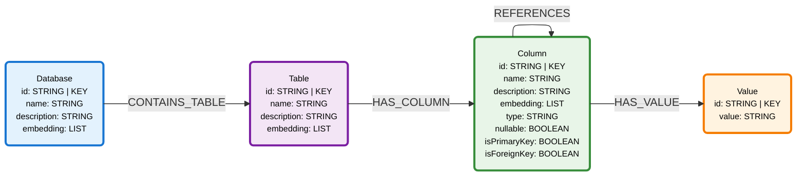
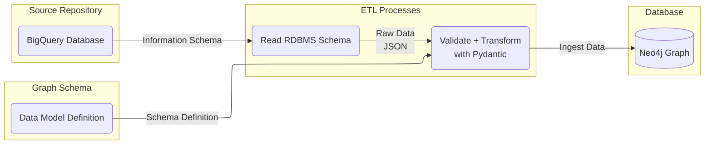
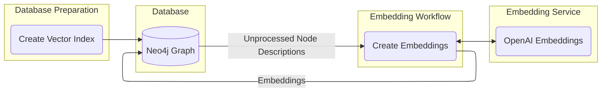
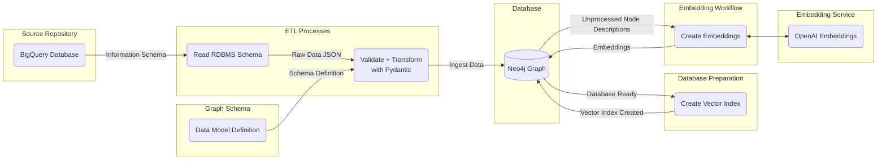
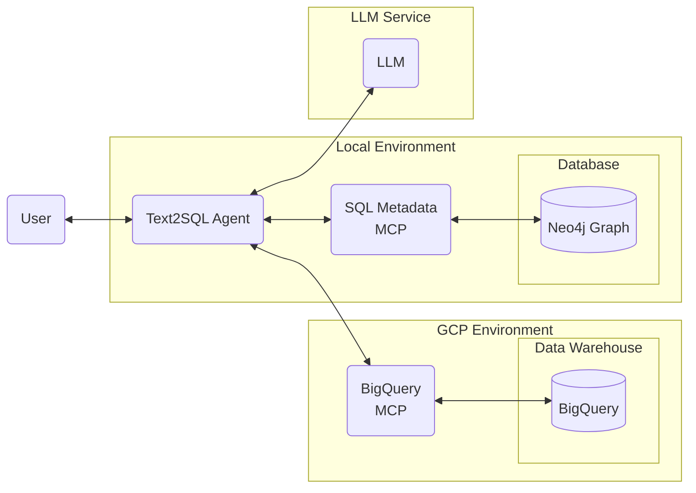

# Text2SQL Template

End to end template for generating a RDBMS metadata knowledge graph for Text2SQL workflows.

## Metadata Graph

The metadata graph has the following schema. All connectors must convert their schema information to this graph schema to be compatible with the provided MCP server and ingestion tooling.



Nodes
* `Database`
* `Table`
* `Column`
* `Value`

Relationships
* `(:Database)-[:CONTAINS_TABLE]->(:Table)`
* `(:Table)-[:HAS_COLUMN]->(:Column)`
* `(:Column)-[:HAS_VALUE]->(:Value)`
* `(:Column)-[:REFERENCES]->(:Column)`


## Graph Generation

This project provides connectors to 
* Connect to source data
* Read metadata tables 
* Transform metadata into defined Neo4j schema
* Ingest transformed data into Neo4j

### Connectors

**BigQuery**

Connector for reading BigQuery Information Schema tables and ingesting metadata into Neo4j. Primary and foreign keys must be defined in the Information Schema tables in order for column level relationships to be created in the Neo4j graph.

This workflow requires the following variables to be set in the `.env` file:
* NEO4J_USERNAME=neo4j-username
* NEO4J_PASSWORD=neo4j-password
* NEO4J_URI=neo4j-uri
* NEO4J_DATABASE=neo4j-database
* BIGQUERY_PROJECT_ID=project-id
* BIGQUERY_DATASET_ID=dataset-id


#### Workflow Architecture


#### Code Example

```python
import asyncio
import os
from neo4j import GraphDatabase
from google.cloud import bigquery
from connectors.bigquery.workflow import bigquery_workflow

neo4j_driver = GraphDatabase.driver(
    uri=os.getenv("NEO4J_URI"),
    auth=(os.getenv("NEO4J_USERNAME"), os.getenv("NEO4J_PASSWORD")),
)
neo4j_database = os.getenv("NEO4J_DATABASE", "neo4j")
bigquery_client = bigquery.Client(project=os.getenv("BIGQUERY_PROJECT_ID"))

# extract, transform, and load BigQuery data into Neo4j
bigquery_workflow(
    bigquery_client,
    os.getenv("BIGQUERY_PROJECT_ID"),
    os.getenv("BIGQUERY_DATASET_ID"),
    neo4j_driver,
    neo4j_database,
)
```

### Embeddings 

Embeddings are generated for the `description` fields of the following nodes:
* `Database`
* `Table`
* `Column`

This project currently supports the following embeddings Providers:
* OpenAI

This workflow requires the following variables to be set in the `.env` file:
* OPENAI_API_KEY=sk-...

#### Workflow Architecture



#### Code Example

```python
import asyncio
import os
from neo4j import GraphDatabase
from openai import AsyncOpenAI
from embeddings.openai_embeddings import openai_embeddings_workflow

# init connections
neo4j_driver = GraphDatabase.driver(
    uri=os.getenv("NEO4J_URI"),
    auth=(os.getenv("NEO4J_USERNAME"), os.getenv("NEO4J_PASSWORD")),
)
neo4j_database = os.getenv("NEO4J_DATABASE", "neo4j")
embedding_client = AsyncOpenAI(api_key=os.getenv("OPENAI_API_KEY"))

# The node labels to generate embeddings for
node_labels = ["Database", "Table", "Column"]

# create embeddings for the nodes
await openai_embeddings_workflow(
    neo4j_driver,
    embedding_client,
    "text-embedding-3-small",
    768,
    node_labels,
    neo4j_database,
)
```

## Sample Dataset

This repository contains a sample dataset of ecommerce data.

Ensure that the following environment variable is set before running and that you are credentialed via the gcloud cli.

```bash
BIGQUERY_PROJECT_ID=project-id
```

To create the dataset in your BigQuery instance, you may run the following Make command.

```bash
make load-ecommerce-dataset
```

### Full Pipeline

The full graph generation pipeline will run the BigQuery workflow followed by the embedding generation workflow. 

It requires the following variables to be set in the `.env` file:
* NEO4J_USERNAME=neo4j-username
* NEO4J_PASSWORD=neo4j-password
* NEO4J_URI=neo4j-uri
* NEO4J_DATABASE=neo4j-database
* BIGQUERY_PROJECT_ID=project-id
* BIGQUERY_DATASET_ID=dataset-id
* OPENAI_API_KEY=sk-...

#### Architecture

The combined BigQuery + Embeddings workflow is seen below.



**Running The Full Workflow**

To run the full workflow, use the following Make command:

```bash
make create-graph
```

## MCP

This project uses two MCP servers for the Text2SQL agent.

### **Local SQL Metadata MCP Server**

This is a custom SQL metadata retrieval MCP server that provides tools to query the Neo4j database for relevant RDBMS schema information using semantic similarity search.

**Tools**
* `get_metadata_schema_by_semantic_similarity` - Retrieves table metadata using vector similarity search on column embeddings and graph traversal. Returns the most relevant tables and column subset with their references, and example values.
* `get_full_metadata_schema` - Retrieves complete metadata schema for all tables in the database. Returns the tables and columns with their references, and example values.


**Environment Variables**
* `NEO4J_URI` - Neo4j database connection URI (e.g., `bolt://localhost:7687`)
* `NEO4J_USERNAME` - Neo4j username (default: `neo4j`)
* `NEO4J_PASSWORD` - Neo4j password
* `NEO4J_DATABASE` - Neo4j database name (default: `neo4j`)
* `OPENAI_API_KEY` - OpenAI API key for generating query embeddings
* `EMBEDDING_MODEL` - OpenAI embedding model to use (default: `text-embedding-3-small`)
* `EMBEDDING_DIMENSIONS` - Embedding vector dimensions (default: `768`)


### **Remote BigQuery MCP Server**

This is the official BigQuery remote MCP server and will be used to execute SQL queries against our database.

Since this is a remote server, we don't need to worry about hosting it locally. We can just connect to the MCP endpoint in our GCP environment.

**Tools** (Filtered subset of total tools the server provides)
* `execute_sql` - Execute a SQL query against BigQuery. Returns the raw results.

*Unused BigQuery MCP Tools*
* `list_dataset_ids`
* `get_dataset_info`
* `list_table_ids`
* `get_table_info`

#### Set Up

Enable use of the [Bigquery MCP server](https://docs.cloud.google.com/bigquery/docs/reference/mcp) in your project.

Additional information may be found [here](https://docs.cloud.google.com/bigquery/docs/use-bigquery-mcp).

PROJECT_ID=Google Cloud project ID
SERVICE=bigquery.googleapis.com

```bash
gcloud beta services mcp enable SERVICE --project=PROJECT_ID
```

To disable again run

```bash
gcloud beta services mcp disable SERVICE --project=PROJECT_ID
```

You can test the BigQuery server connection with the following curl command

```bash
curl -k \
  -H "Content-Type: application/json" \
  -H "Authorization: Bearer $(gcloud auth application-default print-access-token)" \
  -d '{
  "jsonrpc": "2.0",
  "id": 3,
  "method": "tools/call",
  "params": {
    "name": "execute_sql",
    "arguments": {
      "projectId": "<PROJECT_ID>",
      "query": "SELECT table_name FROM `<PROJECT_ID>.<DATASET_ID>.INFORMATION_SCHEMA.TABLES`"
    }
  }
}' \
  https://bigquery.googleapis.com/mcp
```

## Agent

This is the Text2SQL agent that converts natural language questions into SQL queries for BigQuery. The agent uses two MCP servers to:
1. Retrieve relevant database metadata from Neo4j using semantic similarity
2. Execute generated SQL queries against BigQuery

The agent architecture can be seen below.



**How it works**
1. User asks a natural language question about the data
2. Agent calls the SQL Metadata MCP server to retrieve relevant table schemas
3. Agent generates a SQL query via an LLM call based on the retrieved metadata context
4. Agent calls `execute_sql` from the BigQuery MCP server to run the query against BigQuery
5. Agent returns formatted results to the user

**Running the Agent**

Use this command to run the agent locally:
```bash
make agent
```

The agent will start an interactive chat session in the terminal where you can ask questions about your data.


**BigQuery MCP Authentication**

The agent uses Google Cloud Application Default Credentials for BigQuery authentication:

```python
class GoogleAuth(httpx.Auth):
    def __init__(self):
        self.credentials, _ = default()

    def auth_flow(self, request):
        self.credentials.refresh(Request())
        request.headers["Authorization"] = f"Bearer {self.credentials.token}"
        yield request
```

Make sure you're authenticated with:
```bash
gcloud auth application-default login
```

**Environment Variables**

Required environment variables (add to `.env` file):

**Neo4j Connection**
* `NEO4J_URI` - Neo4j database URI (e.g., `bolt://localhost:7687`)
* `NEO4J_USERNAME` - Neo4j username (default: `neo4j`)
* `NEO4J_PASSWORD` - Neo4j password
* `NEO4J_DATABASE` - Neo4j database name (default: `neo4j`)

**LLM - OpenAI**
* `OPENAI_API_KEY` - OpenAI API key for embeddings and LLM

**Example Usage**

```
> What are the total sales by product category?

Agent: [Calls get_metadata_schema_by_semantic_similarity with query about sales and categories]
Agent: [Generates SQL query using retrieved schema]
Agent: [Calls execute_sql with generated query]
Agent: Here are the total sales by product category:
- Electronics: $15,234.50
- Clothing: $8,912.30
...
```


