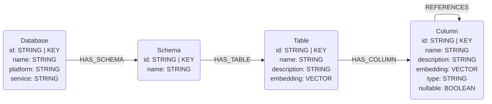
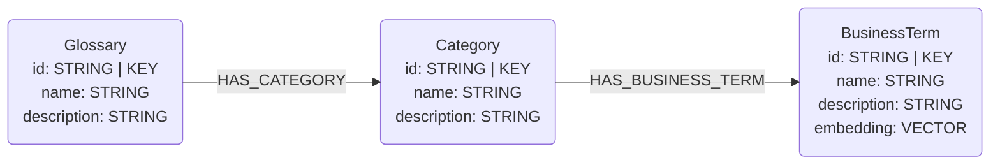
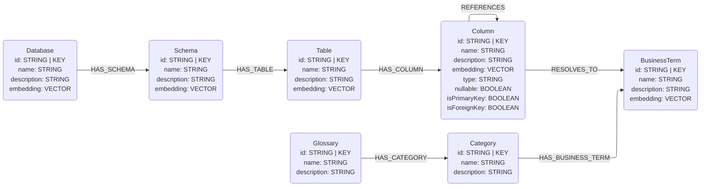

# GCP Dataplex Universal Catalog Connector

## Overview

This connector reads information from the GCP Dataplex Universal Catalog via the Python client and maps it to the graph data model schema defined in this library. 

Currently this connector supports reading BigQuery metadata stored in Dataplex and Glossary information.

## Data Models

### BigQuery Metadata

The BigQuery metadata available via Dataplex is not as comprehensive as reading the metadata directly from BigQuery. Below is the supported data model. Notably absent are the primary and foreign key identifiers. Each column is therefore loaded with `isPrimaryKey=False` and `isForeignKey=False`.



### Glossary Information

Dataplex has a Glossary that allows us to store business terms. Ideally terms may then be connected to columns, which allows us to infer table relationships via columns that resolve to a shared business term. Below is the data model for Dataplex glossary information.



## Known Issues

### Unable to connect business terms to columns

The Dataplex API has no method of retrieving entityLink IDs. This means that we can not automatically retrieve the connections between columns and business terms. This is a feature that is in [the preview version](https://docs.cloud.google.com/dataplex/docs/manage-glossaries#rest_23) of the Dataplex API and should be released in the future. Once publically available, it will be implemented in this library. 

The goal data model is shown below. Note that `Value` nodes are still absent in the Dataplex output.



### Aspect handling

Information such as primary / foreign keys and data stewardship may be defined as Dataplex Aspects. Aspects are custom definitions and so automating the indetification and mapping of Aspects to Steward nodes, for example, is difficult. Additionally, the inaccessible entityLink IDs mean that even if we properly map these Aspects to nodes in our data model, we can't identify relationships via the Dataplex API.

## Usage

The Dataplex connector is organized as a workflow class that orchestrates the extraction, transformation, and loading of metadata from Dataplex into Neo4j.

### Code Example

```python
import os
from neo4j import GraphDatabase
from google.cloud import dataplex_v1
from connectors.dataplex.workflow import DataplexWorkflow

# Initialize clients
neo4j_driver = GraphDatabase.driver(
    uri=os.getenv("NEO4J_URI"),
    auth=(os.getenv("NEO4J_USERNAME"), os.getenv("NEO4J_PASSWORD")),
)
neo4j_database = os.getenv("NEO4J_DATABASE", "neo4j")
catalog_client = dataplex_v1.CatalogServiceClient()
glossary_client = dataplex_v1.BusinessGlossaryServiceClient()

# Create workflow instance
workflow = DataplexWorkflow(
    catalog_client=catalog_client,
    glossary_client=glossary_client,
    project_id=os.getenv("GCP_PROJECT_ID"),
    project_number=os.getenv("GCP_PROJECT_NUMBER"),
    dataplex_location=os.getenv("DATAPLEX_LOCATION"),
    dataset_id=os.getenv("BIGQUERY_DATASET_ID"),
    neo4j_driver=neo4j_driver,
    database_name=neo4j_database,
    include_schema=True,      # Include BigQuery metadata
    include_glossary=True,     # Include Glossary information
)

# Run the workflow to extract, transform, and load Dataplex metadata into Neo4j
workflow.run()
```

### Environment Variables

The following environment variables are required:

* `NEO4J_URI` - Neo4j database connection URI (e.g., `bolt://localhost:7687`)
* `NEO4J_USERNAME` - Neo4j username (default: `neo4j`)
* `NEO4J_PASSWORD` - Neo4j password
* `NEO4J_DATABASE` - Neo4j database name (default: `neo4j`)
* `GCP_PROJECT_ID` - Google Cloud project ID
* `GCP_PROJECT_NUMBER` - Google Cloud project number
* `DATAPLEX_LOCATION` - Dataplex location (e.g., `us-central1`)
* `BIGQUERY_DATASET_ID` - BigQuery dataset ID (optional, can be passed to `run()` method)

### Workflow Components

The `DataplexWorkflow` class encapsulates three main components:

* **DataplexExtractor** - Extracts metadata from Dataplex Universal Catalog
* **DataplexTransformer** - Transforms extracted data to the graph schema
* **Neo4jLoader** - Loads transformed data into Neo4j

