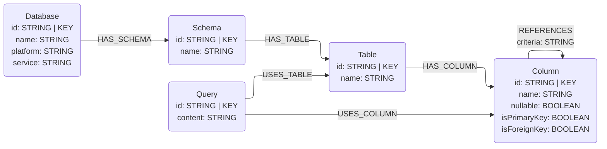

# Query Log Connector

## Overview

This connector is based on work by Jeff Davis, a Solutions Engineer at Neo4j.

This connector allows query log files to be parsed into the metadata graph schema. 
Query log parsing allows relationships between columns and tables to be discovered based on how users query the system, 
instead of relying on explicit documentation such as foreign key constraints.

Currently the Query Log Workflow only supports query logs from **BigQuery in JSON file format**. 
More databases and log retrieval methods are planned for future versions.

## Data Models

Some information is not accessible by reading query logs. Information such as primary and foreign key identifiers and whether a column is nullable is not avialable. Each column is therefore loaded with `nullable=True`, `isPrimaryKey=False`, `isForeignKey=False` and missing `type` information. We also do not include `description` or `embedding` properties on any nodes.

When creating a graph from query logs, we are able to see how columns are used in `JOIN` conditions. This lets us persist the `JOIN` criteria on `(:Column)-[:REFERENCES]->(:Column)` relationships for additional context.

We also have direct access to queries run against the tables. We may persist the queries as `Query` nodes in the graph and use them as few shot examples in the context.



## Usage

The Query Log connector is organized as a workflow class that orchestrates the extraction, transformation, and loading of query log metadata into Neo4j.

### Code Example

```python
import os
from neo4j import GraphDatabase
from connectors.query_log.workflow import QueryLogWorkflow

# Initialize Neo4j connection
neo4j_driver = GraphDatabase.driver(
    uri=os.getenv("NEO4J_URI"),
    auth=(os.getenv("NEO4J_USERNAME"), os.getenv("NEO4J_PASSWORD")),
)
neo4j_database = os.getenv("NEO4J_DATABASE", "neo4j")

# Create workflow instance
workflow = QueryLogWorkflow(
    neo4j_driver=neo4j_driver,
    database_name=neo4j_database,
)

# Run the workflow to extract, transform, and load query log metadata into Neo4j
workflow.run(
    query_log_file="path/to/query_log.json",
    source="bigquery"  # Currently only "bigquery" is supported
)
```

### Environment Variables

The following environment variables are required:

* `NEO4J_URI` - Neo4j database connection URI (e.g., `bolt://localhost:7687`)
* `NEO4J_USERNAME` - Neo4j username (default: `neo4j`)
* `NEO4J_PASSWORD` - Neo4j password
* `NEO4J_DATABASE` - Neo4j database name (default: `neo4j`)

### Workflow Components

The `QueryLogWorkflow` class encapsulates three main components:

* **QueryLogExtractor** - Extracts metadata from query log files and parses SQL queries
* **QueryLogTransformer** - Transforms extracted data to the graph schema
* **Neo4jLoader** - Loads transformed data into Neo4j

### Obtaining BigQuery Query Logs

To get query logs from BigQuery in JSON format, you can use the Cloud Logging API or the `gcloud` CLI:

#### Using gcloud CLI

```bash
# Set your project ID
PROJECT_ID="your-project-id"

# Export query logs to a JSON file
gcloud logging read \
  "resource.type=bigquery_resource AND protoPayload.methodName=jobservice.query" \
  --project=$PROJECT_ID \
  --format=json \
  --freshness=7d
  --limit=1000 > query_log.json
```

## Known Issues

No known issues at the moment.

