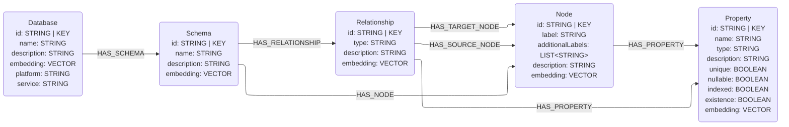
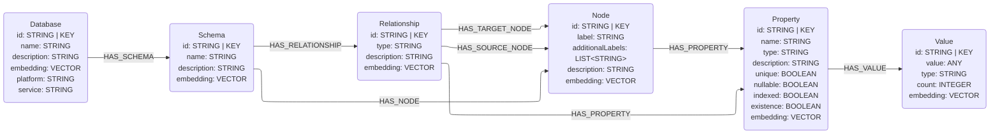

# Label Property Graph Data Model Components

This module contains the graph data model components for a Labeled Property Graph (LPG) metadata graph.

**The data model components defined in this document are subject to change throughout development.**

> **Warning:** Importing this module raises a `UserWarning`: *"LPG data model components are an in-progress feature. There is no application in the current library version."*

## Core Data Model **(Not Implemented)**

The core data model represents the metadata structure of a Labeled Property Graph database. It consists of five nodes and seven relationships.

Nodes
* `Database`
    * Top level node containing information about the graph database
    * Properties: id, name, description, embedding, platform, service
* `Schema`
    * Contains details about the database schema or namespace
    * Properties: id, name, description, embedding
* `Node`
    * Represents a node label in the LPG
    * Contains information about nodes with this label in the graph database
    * Properties: id, label, additionalLabels, description, embedding
* `Relationship`
    * Represents a relationship type in the LPG
    * Contains information about relationships of this type in the graph database
    * Properties: id, type, description, embedding
* `Property`
    * Represents a property that can exist on nodes or relationships
    * Properties: id, name, type, description, unique, nullable, indexed, existence, embedding

Relationships
* `(:Database)-[:HAS_SCHEMA]->(:Schema)`
    * Defines the database to schema hierarchy
* `(:Schema)-[:HAS_NODE]->(:Node)`
    * Defines which node labels exist in the schema
* `(:Schema)-[:HAS_RELATIONSHIP]->(:Relationship)`
    * Defines which relationship types exist in the schema
* `(:Relationship)-[:HAS_SOURCE_NODE]->(:Node)`
    * Defines the source node label for a relationship type
* `(:Relationship)-[:HAS_TARGET_NODE]->(:Node)`
    * Defines the target node label for a relationship type
* `(:Node)-[:HAS_PROPERTY]->(:Property)`
    * Defines which properties exist on a node label
* `(:Relationship)-[:HAS_PROPERTY]->(:Property)`
    * Defines which properties exist on a relationship type

## Property Values **(Not Implemented)**

Property values represent the distinct values that exist for properties in the graph database.
This allows for value profiling and understanding the distribution of data.

Nodes
* `Value`
    * Represents a distinct value for a property
    * Properties: id, value, type, count, embedding

Relationships
* `(:Property)-[:HAS_VALUE]->(:Value)`
    * Defines the distinct values that exist for a property
    * The count property on the Value node indicates how many times this value appears

## Glossary Data Model **(Not Implemented)**

Data catalogs allow business terms to be defined and linked to nodes, relationships, and properties.
This allows semantic relationships to be inferred by shared business terms.

Nodes
* `Glossary`
    * The glossary containing categories and business terms
* `Category`
    * Contains information about a category in the glossary
* `BusinessTerm`
    * A leaf level term in the glossary
    * Defines globally recognized term across databases in the system

Relationships
* `(:Glossary)-[:HAS_CATEGORY]->(:Category)`
    * Defines glossary to category hierarchy
* `(:Category)-[:HAS_BUSINESS_TERM]->(:BusinessTerm)`
    * Defines category to business term hierarchy
* `(:Node)-[:RESOLVES_TO]->(:BusinessTerm)`
    * Defines how a node label resolves to a business term
* `(:Relationship)-[:RESOLVES_TO]->(:BusinessTerm)`
    * Defines how a relationship type resolves to a business term
* `(:Property)-[:RESOLVES_TO]->(:BusinessTerm)`
    * Defines how a property resolves to a business term

## Data Stewards **(Not Implemented)**

Data catalogs allow data stewards to be defined and linked to the appropriate assets in the graph database.

Nodes
* `Steward`

Relationships
* `(:Steward)-[:STEWARDS_SCHEMA]->(:Schema)`
* `(:Steward)-[:STEWARDS_NODE]->(:Node)`
* `(:Steward)-[:STEWARDS_RELATIONSHIP]->(:Relationship)`
* `(:Steward)-[:STEWARDS_CATEGORY]->(:Category)`
* `(:Steward)-[:STEWARDS_BUSINESS_TERM]->(:BusinessTerm)`

## Rules **(Not Implemented)**

Data catalogs allow for data quality and business rules to be defined and linked to the appropriate assets.
These rules may be returned alongside their respective data assets to guide the agent in how to use them properly.

Nodes
* `DataQualityRule`
    * A rule that enforces data correctness and completeness
* `BusinessRule`
    * A rule that describes business logic and constraints

Relationships
* `(:DataQualityRule)-[:ENFORCES_NODE]->(:Node)`
* `(:DataQualityRule)-[:ENFORCES_RELATIONSHIP]->(:Relationship)`
* `(:DataQualityRule)-[:ENFORCES_PROPERTY]->(:Property)`
* `(:BusinessRule)-[:APPLIES_TO_NODE]->(:Node)`
* `(:BusinessRule)-[:APPLIES_TO_RELATIONSHIP]->(:Relationship)`
* `(:BusinessRule)-[:APPLIES_TO_PROPERTY]->(:Property)`
* `(:BusinessRule)-[:RELATED_TO]->(:BusinessTerm)`
    * Defines which business terms are related to the business rule
    * This relationship may be used to identify nodes, relationships, or properties that are impacted by a business rule

## Cypher Queries **(Not Implemented)**

Cypher queries may be cached in the graph and provided as few-shot examples in the context.

Nodes
* `Query`

Relationships
* `(:Query)-[:USES_NODE]->(:Node)`
* `(:Query)-[:USES_RELATIONSHIP]->(:Relationship)`
* `(:Query)-[:USES_PROPERTY]->(:Property)`

## Metrics + KPIs **(Not Implemented)**

Metrics and KPIs may be stored in the graph and linked to their associated nodes, relationships, and properties.
They may also be linked to `Query` nodes, which define how to calculate the metric.
`Metric` is the main node label, however they may also have the additional node label `KPI`.

Nodes
* `Metric`
* `Metric&KPI`
    * All `KPI` labels are an additional label on `Metric` nodes

Relationships
* `(:Metric&KPI)-[:HAS_QUERY]->(:Query)`